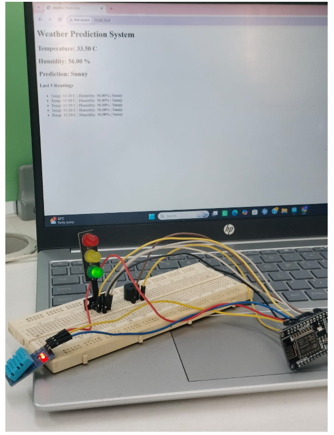

## 🌦️ Weather Prediction System using DHT11 and ESP8266

## 📌 Project Overview
The Weather Prediction System is an IoT project built using the ESP8266 (NodeMCU) and DHT11 Temperature & Humidity Sensor. The system continuously monitors temperature and humidity and displays the readings on a web page over Wi-Fi. This project is suitable for weather monitoring, smart homes, and IoT learning.

## 🎯 Objective
Measure temperature and humidity in real time.
Display sensor readings on a web page.
Enable wireless monitoring using Wi-Fi.
Learn IoT-based environmental monitoring with ESP8266.

## 🛠️ Components Required
ESP8266 NodeMCU,
DHT11 Temperature & Humidity Sensor,
Breadboard,
Jumper Wires,
USB Cable,
Wi-Fi Connection

## ⚙️ Working Principle
The DHT11 sensor measures the surrounding temperature and humidity.
ESP8266 reads the sensor values.
The data is processed and updated in real time.
A web server hosted on the ESP8266 displays the readings.
Users can monitor the weather data from any device connected to the same Wi-Fi network.

## 🌐 Web Interface Features
🌡️ Real-Time Temperature Display,
💧 Humidity Percentage,
📱 Responsive HTML & CSS Web Dashboard,
🔄 Automatic Data Refresh

## ▶️ How to Run
Connect the DHT11 sensor to the ESP8266.
Open the project in Arduino IDE.
Install the ESP8266 Board Package and DHT library.
Enter your Wi-Fi SSID and Password in the code.
Upload the code to the ESP8266.
Open the Serial Monitor.
Copy the IP address displayed.
Open the IP address in a web browser.
View the live temperature and humidity values.

## 📊 Sample Output
Temperature	Humidity	Status
24°C	55%	Comfortable
30°C	70%	Warm & Humid
18°C	40%	Cool & Dry

## 🌍 Applications
Weather Monitoring,
Smart Home Automation,
Greenhouse Monitoring,
Environmental Monitoring,
IoT Learning Projects

## 🚀 Features
Real-Time Temperature Monitoring,
Real-Time Humidity Monitoring,
Wi-Fi Enabled,
Live Web Dashboard,
Beginner-Friendly ESP8266 Project,
Responsive Web Interface

## 💻 Software Used
Arduino IDE,
ESP8266 Board Package,
DHT Sensor Library,
HTML,
CSS

## 👩‍💻 Developed By

Sadhana

